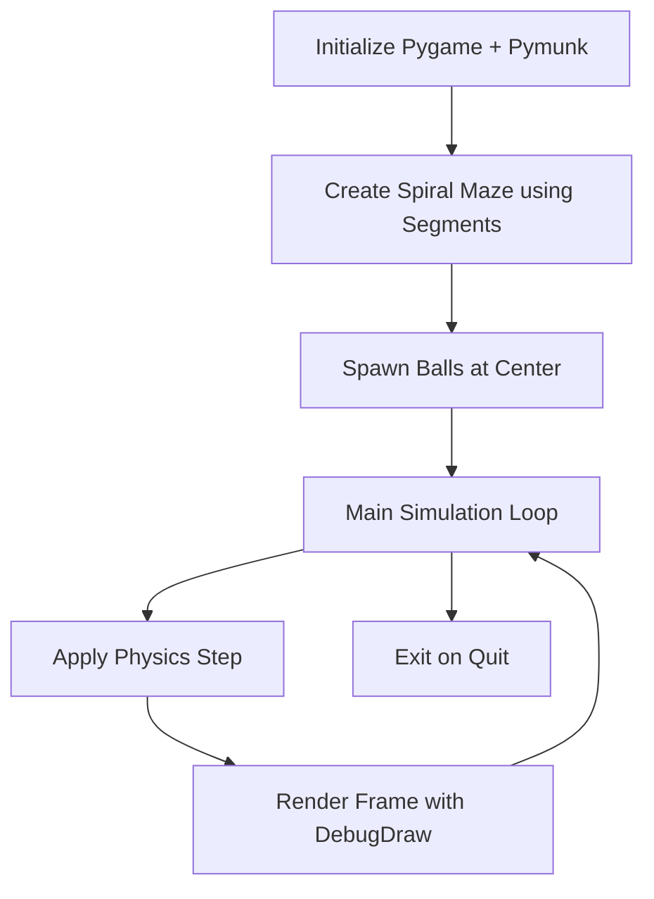

# Spiral Maze Simulation

[](https://github.com/OWNER/REPO/actions/workflows/main.yml)

A Pygame simulation of balls colliding in a spiral maze using the Pymunk physics library.

## Running the Simulation

1.  **Clone the repository:**
    ```bash
    git clone https://github.com/OWNER/REPO.git
    cd <REPO>
    ```
2.  **Set up a virtual environment (recommended):**
    ```bash
    python -m venv venv
    source venv/bin/activate  # On Windows use `venv\Scripts\activate`
    ```
3.  **Install dependencies:**
    ```bash
    pip install -r requirements.txt
    ```
4.  **Run the simulation:**
    ```bash
    python simulation.py
    ```

## Running Tests

To run the automated tests:

```bash
python test_simulation.py
```

---

# 🌀 Spiral Maze Ball Simulation using Pymunk

This project demonstrates a **2D physics simulation** of balls bouncing within a **spiral maze**, using `pymunk` and `pygame`.

The simulation is a stress test for multi-modal reasoning—useful in robotics and digital twin scenarios where understanding physics, geometry, and motion is essential.

---

## 📦 Requirements

Make sure to install the following libraries:

```bash
pip install pygame pymunk
```

---

## 📁 Project Files

- `spiral_maze_simulation.ipynb` – Jupyter Notebook running the Pymunk simulation
- `README.md` – You're reading it!

---

## 🚀 How to Run

1. Open `spiral_maze_simulation.ipynb` in Jupyter Notebook.
2. Run all cells to launch the simulation.
3. Watch the balls bounce and spiral through the maze!

---

## 🧠 What It Demonstrates

- Realistic **collision physics**
- Use of **spiral equations** in simulation:  
  Spiral radius `r(θ) = aθ + b`
- Real-time rendering of **complex boundaries**
- Physics engine: **Pymunk** (built on Chipmunk2D)

---

## 🔁 Flow Diagram



---

## 🌀 Spiral Generation

The spiral is generated by rotating an angle `θ` from 0 to `n * 2π`, and plotting the coordinates:

```python
r = SPIRAL_SPACING * theta + base_offset
x = CENTER_X + r * cos(theta)
y = CENTER_Y + r * sin(theta)
```

Each `(x, y)` point is connected to form **segment walls**, added to the Pymunk static body.

---

## 🧪 Suggested Extensions

- Add gravity or vertical spiral funnels
- Make the spiral dynamic or deforming
- Add object-tracking or trajectory prediction

---

## 📸 Preview

*(Run the notebook to see in action!)*

---
